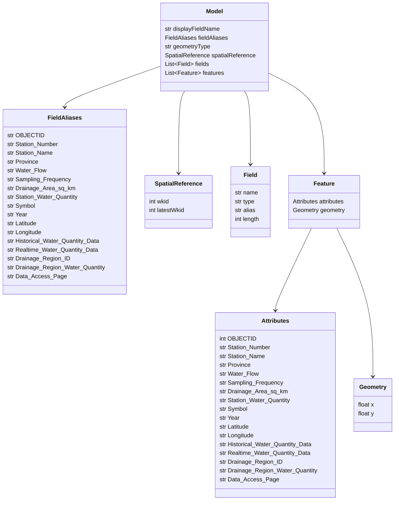

```mermaid
%% Generated by ChatGPT from esri_fc.py

classDiagram

class Model {
    str displayFieldName
    FieldAliases fieldAliases
    str geometryType
    SpatialReference spatialReference
    List~Field~ fields
    List~Feature~ features
}

class FieldAliases {
    str OBJECTID
    str Station_Number
    str Station_Name
    str Province
    str Water_Flow
    str Sampling_Frequency
    str Drainage_Area_sq_km
    str Station_Water_Quantity
    str Symbol
    str Year
    str Latitude
    str Longitude
    str Historical_Water_Quantity_Data
    str Realtime_Water_Quantity_Data
    str Drainage_Region_ID
    str Drainage_Region_Water_Quantity
    str Data_Access_Page
}

class SpatialReference {
    int wkid
    int latestWkid
}

class Field {
    str name
    str type
    str alias
    int length
}

class Feature {
    Attributes attributes
    Geometry geometry
}

class Attributes {
    int OBJECTID
    str Station_Number
    str Station_Name
    str Province
    str Water_Flow
    str Sampling_Frequency
    str Drainage_Area_sq_km
    str Station_Water_Quantity
    str Symbol
    str Year
    str Latitude
    str Longitude
    str Historical_Water_Quantity_Data
    str Realtime_Water_Quantity_Data
    str Drainage_Region_ID
    str Drainage_Region_Water_Quantity
    str Data_Access_Page
}

class Geometry {
    float x
    float y
}

Model --> FieldAliases
Model --> SpatialReference
Model --> Field
Model --> Feature
Feature --> Attributes
Feature --> Geometry
```